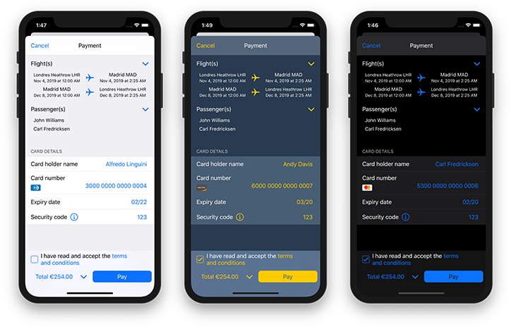

# Amadeus Checkout iOS SDK

The Amadeus Checkout SDK for iOS makes it ease to build the payment experience of your iOS app. Use our customizable component to propose to your users all large set of method of payment.

  

## Table of Content

   * [Prerequisites](#prerequisites)
   * [Installation](#installation)
       * [Using Cocoapods](#using-cocoapods)
       * [Using Carthage](#using-carthage)
       * [Using dynamic framework](#using-dynamic-framework)
   * [Plugins](#plugins)
   * [Usage](#usage)
       * [Initiate payment](#initiate-payment)
       * [Status callbacks](#status-callbacks)
       * [Customization](#customization)

## Prerequisites

You need to be registeted as a customer of the [Amadeus Payment Platform](https://amadeus.com/en/business-function/payments/xchange-payment-platform).
Then, right before starting the checkout process, you need to retrieve a PPID from you server. To do so, your server has to call the `AMA_PAY_PreparePaymentPage` webservice, with your merchant identifier, the currency and the amount to be paid. 

## Installation

### Using Cocoapods

Add this line to your *Podfile*
```
use_frameworks!
pod 'AmadeusCheckout', :git => 'https://github.com/AmadeusITGroup/Checkout-Experience-iOS.git', :tag => '1.0.0'
```

Then run the following command:
`$ pod install`

If you are working on a Objective-C project, you may need to add a dummy swift file to project: `Dummy.swift`
Xcode will ask if you want to configure an Objective-C bridging header, you can answer *Don't create*.

### Using Carthage

Add this line to your *Cartfile*
`git "https://github.com/AmadeusITGroup/Checkout-Experience-iOS.git" == 1.0.0`

Then follow the [Carthage installation instructions](https://github.com/Carthage/Carthage#if-youre-building-for-ios-tvos-or-watchos).


### Using dynamic framework

Drag `AmadeusCheckout.framework` to the *Embedded Binaries* section of your Xcode project's *General* settings.
Make sure to select *Copy items if needed*.

Head to the *Build Phases* section of your Xcode project settings, and create a new *Run Script Build Phase*.
Paste the following snippet into the text field:
`bash "${BUILT_PRODUCTS_DIR}/${FRAMEWORKS_FOLDER_PATH}/AmadeusCheckout.framework/strip-frameworks.sh"`

If you are working on a Objective-C project, you may need to set *Always Embed Swift Standard Libraries* to *Yes* in your target build settings.

## Plugins

The features of the *Checkout SDK* can be extended using some third party frameworks.
To activate a given third party framework, you just need to install the proper plugin.

For example, the *CardIOPlugin* allows to scan a credit card with the device camera. 

The integration depends on the used dependency manager:
- **Cocoapods**: add the following line inside your *Podfile*
  `pod 'AmadeusCheckout/CardIOPlugin', :git => 'https://github.com/AmadeusITGroup/Checkout-Experience-iOS.git', :tag => '1.0.0'`
- **Carthage**: all plugins are available in the *Carthage* build folder, just drag the ones you need on your project. Don't forget to also add the associated third party frameworks.
- Manual (dynamic framework) : add the plugin, and the third party framework inside the *Embedded Binaries* section.

## Usage

### Initiate payment

Firstly, you need to initialize your payment context from a PPID:
> Swift
```swift
import AmadeusCheckout

func startPayment() {
    // PPID retrieved from the AMA_PAY_PreparePaymentPage message response:
    let ppid = ...

    // .prd is for production, use .pdt or .uat for test systems:
    self.checkoutCtx = AMCheckoutContext(ppid: ppid, environment:.prd)

    self.checkoutCtx.delegate = self
    self.checkoutCtx.hostViewController = self

    // Option 1: let user select the payment method inside the SDK:
    let options = AMCheckoutOptions()
    self.checkoutCtx.presentChoosePaymentMethodViewController(options: options)

    // Option 2: retrieve the list of available methods of payment, and pay directly with a specific one:
    self.checkoutCtx.fetchPaymentMethods(callback: {[weak self] methods: [AMPaymentMethod] in
        // Save the payment methods somewhere, or trigger directly the payment with a specific mop
    })
}
```
> Objective-C
```objectivec
@import AmadeusCheckout

-(void)startPayment {
    // PPID retrieved from the PreparePaymentPage message response:
    NSString * ppid = ... ;

    // .prd is for production, use .pdt or .uat for test systems:
    self.checkoutCtx = [[AMCheckoutContext alloc] initWithPpid:ppid environment:AMEnvironmentPrd];

    self.checkoutCtx.delegate = self;
    self.checkoutCtx.hostViewController = self;

    // Option 1: let user select the payment method inside the SDK:
    AMCheckoutOptions * options = [[AMCheckoutOptions alloc] init];
    [self.checkoutCtx presentChoosePaymentMethodViewControllerWithOptions:options];

    // Option 2: retrieve the list of available methods of payment, and pay directly with a specific one:
    [self.checkoutCtx fetchPaymentMethodsWithCallback:^(NSArray<AMPaymentMethod *> * _Nonnull methods) {
        // Save the payment methods somewhere, or trigger directly the payment with a specific mop
        ...
    }
    }];
}
```

If you choosed the Option 2, you will also have to trigger the payment with the choosen method of payment:
> Swift
```swift
let options = AMCheckoutOptions()
self.checkoutCtx.presentPaymentViewController(selectMethod, options: options)
```
> Objective-C
```objectivec
AMCheckoutOptions * options = [[AMCheckoutOptions alloc] init];
[self.checkoutCtx presentPaymentViewController:selectMethod options:options];
```

### Status callbacks

The two following methods are called when the payment is successfull or failed:
> Swift
```swift
func paymentContext(_ checkoutContext: AMCheckoutContext, didFinishWithStatus status: AMPaymentStatus, error: Error?) {
    self.checkoutCtx = nil
    // Handle the success here
}
```
> Objective-C
```objectivec
-(void)paymentContext:(AMCheckoutContext *)checkoutContext didFinishWithStatus:(enum AMPaymentStatus)status error:(NSError *)error {
    self.checkoutCtx = nil;
    // Handle the success here
}
```

The `status` contains one of the following values:
- `success`: the checkout was successful, you can now check the payment status from your back-end  
- `failure`: the checkout failed
- `unknown`: the checkout status is unknown, you have to check the payment status from your back-end
- `cancellation`: the checkout was cancelled by the user


### Customization

#### Font and Colors
You can configure the appearance, by setting the following properties on the `AMCheckoutOptions` instance:

|Name|Type|Description|
|---|---|---|
| `primaryBackgroundColor` | `UIColor` | Background color used for the payment card form |
| `secondaryBackgroundColor` | `UIColor` | Background color used for navigations bar and form groups |
| `primaryForegroundColor` | `UIColor` | Color of labels and navigation bar title |
| `secondaryForegroundColor` | `UIColor` | Color for input placeholders |
| `accentColor` | `UIColor` | Color for navigation bar buttons, icons and input |
| `errorColor` | `UIColor` | Color for error messages and icons |
| `font` | `UIFont` | Font for input, labels, errors and messages |
| `emphasisFont` | `UIFont` | Font for navigation bar title |

#### Options

|Name|Type|Description|
|---|---|---|
| `termsAndConditions` | `Array` of `AMTermsAndConditions` | List of terms and conditions URLs. If at least one is provided, the user will have to tick a terms & conditions checkbox (for payment cards only). If you provide several links, user will be able to open them one by one, in that case please provide a relevant label for each link. |
| `bookingDetails` | `AMBookingDetails` | List of passengers and/or flights, to be displayed on Credit Card form. If no passenger list or flight list is provided, the corresponding section won't be displayed. |
| `amountBreakdown` | `Array` of `AMAmountDetails` |  |
| `displayPayButtonOnTop` | `Boolean` | Also display the pay button inside the navigation bar  |
| `dynamicVendor` | `Boolean` | Automatically dectect the card type instead of letting the user choosing it |

#### Callback Scheme
If your setup includes an alternative method of payment that may redirect to a third party application or website, you have to set-up a callback scheme.
This scheme will be used to go back to your application when the external action is done.

You have to choose a scheme that is unique for your application, so that you are sure that it's not used by any other application.
For the following examples, we will use ```my-custom-scheme``` as scheme, **please don't forget to replace this value with yours**. 

##### a. Declare the custom scheme in your `Info.plist`
This setup will make your application able to open links in the following format: ```my-custom-scheme://...``` .


```xml
<key>CFBundleURLTypes</key>
<array>
<dict>
<key>CFBundleTypeRole</key>
<string>Editor</string>
<key>CFBundleURLName</key>
<string>com.amadeus.checkout</string>
<key>CFBundleURLSchemes</key>
<array>
<string>my-custom-scheme</string>
</array>
</dict>
</array>
```
##### b. Set the scheme in the `AMCheckoutOptions` instance
>Swift
```swift
options.appCallbackScheme = "my-custom-scheme"
```
> Objective-C
```objectivec
options.appCallbackScheme = @"my-custom-scheme";
```
##### c. Handle the redirection in your AppDelegate
>Swift
```swift
func application(_ application: UIApplication,
    open url: URL,
    options: [UIApplication.OpenURLOptionsKey : Any] = [:] ) -> Bool {
    if AMCheckoutContext.handleUrl(url)  {
        return true
    }
    return false
}
```
> Objective-C
```objectivec
- (BOOL)application:(UIApplication *)app
            openURL:(NSURL *)url
            options:(NSDictionary<UIApplicationOpenURLOptionsKey, id> *)options {
    if([AMCheckoutContext handleUrl:url]) {
        return YES;
    }
    return NO;
}
```

