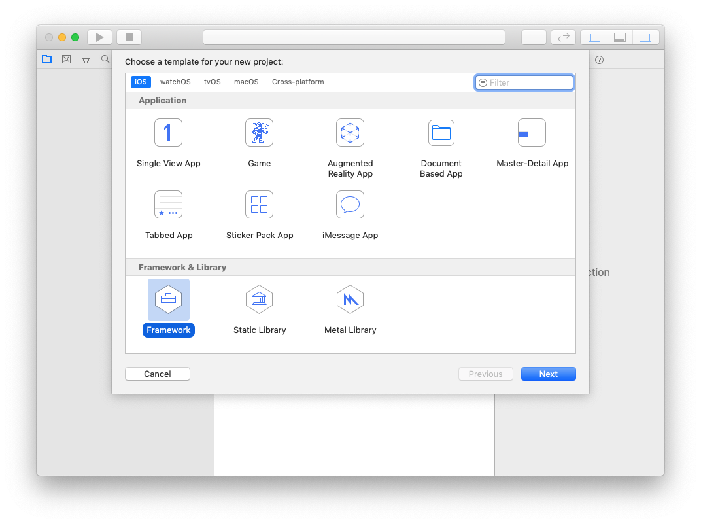
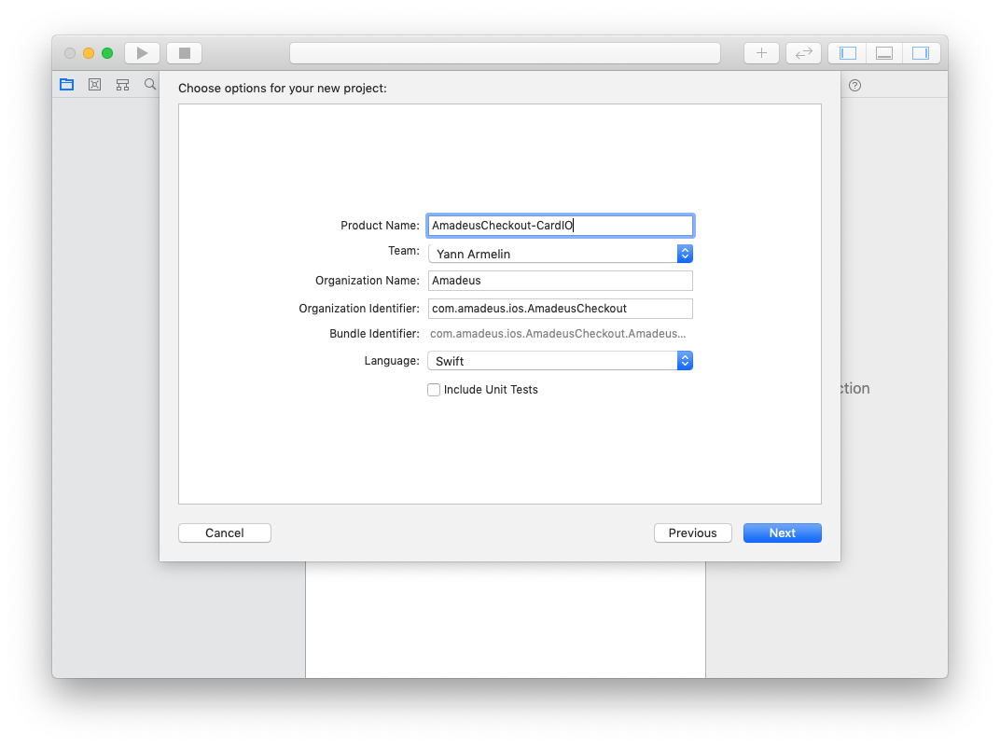
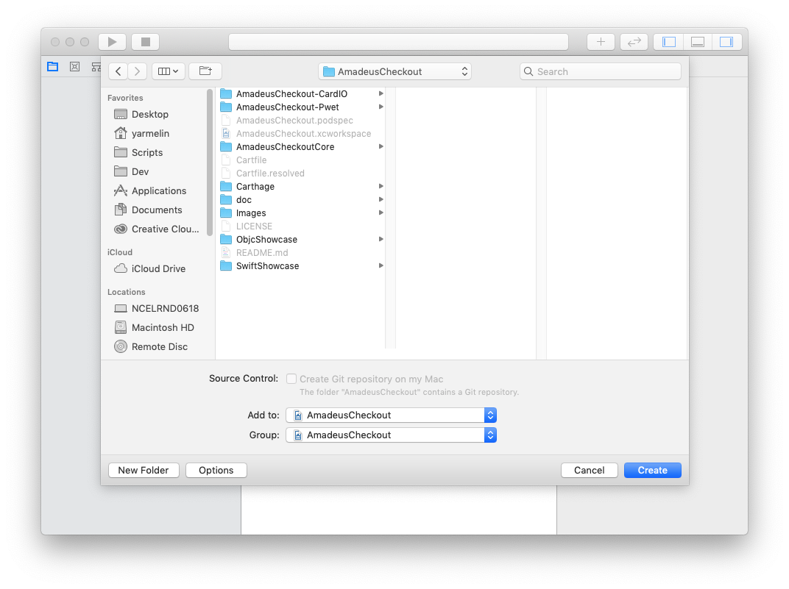
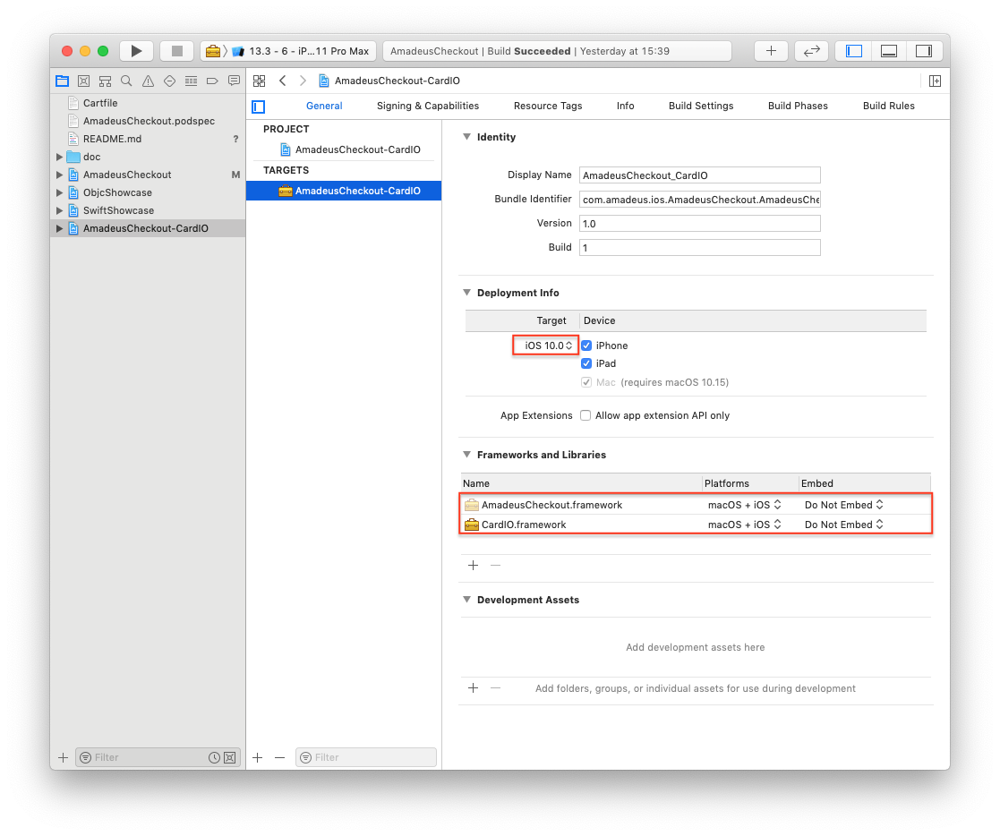
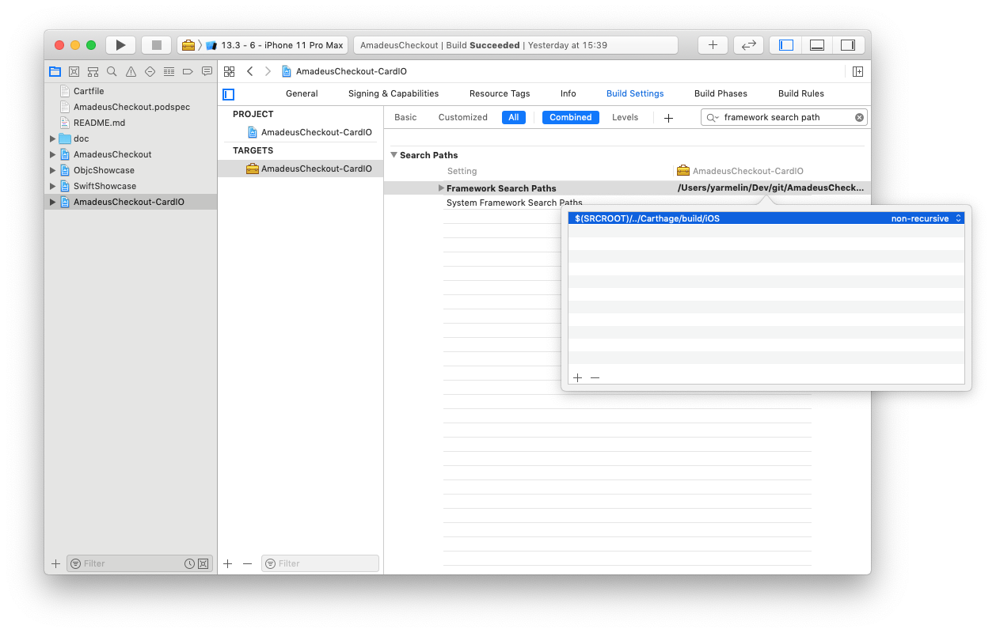
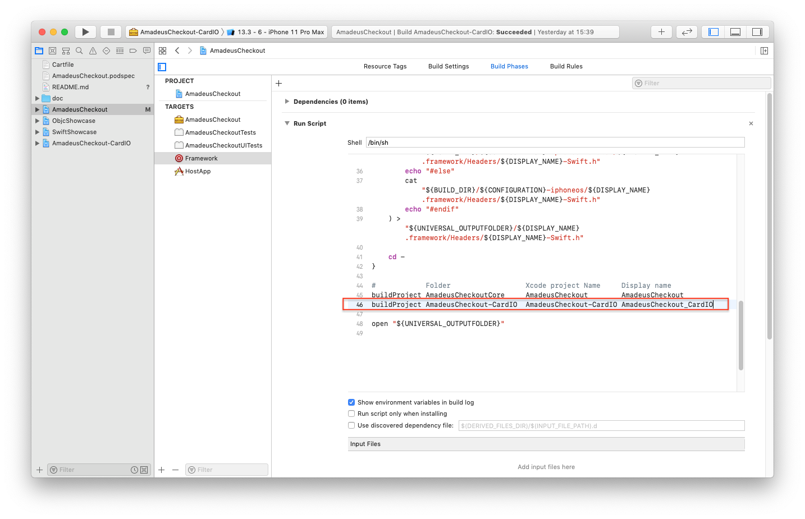

# Checkout Plugins 

## 1. What are plugins for ?
Plugins are needed to integrate a third party library with Amadeus Checkout SDK.
The plugin itself depends on the Checkout Core SDK, and on the third party library.
It contains all the necessary code to make to third party library work.

The dependency graph of the final application, that uses plugin A, and B, would look like that:
```
Application
├── Amadeus Checkout Core SDK
├─┬ Amadeus Checkout A Plugin
│ ├─ A Library
│ └─ Amadeus Checkout Core SDK  *deduped*
└─┬ Amadeus Checkout B Plugin
  ├─ B Library
  └─ Amadeus Checkout Core SDK *deduped*
```

The main benefit of this architecture is to be able in integrate any third party library, without making it mandatory for the host application.

## 2. Creation procedure

### Xcode project creation
- Open the *AmadeusCheckout.xcworkspace* workspace
- Click on *File* ▸ *New* ▸ *Project*
- Select *Framework* inside the iOS section

  
- Put *AmadeusCheckout-`{PluginName}`*  as project name, *Amadeus* as organization, *com.amadeus.ios.AmadeusCheckout* as Organization identifier

  
- Save it inside the *AmadeusCheckout* repositiory root, and select *AmadeusCheckout* inside the *Add to* menu

  

### Dependency configuration
- Add the dependencies you need inside the *Carfile* file
- Run `carthage update`, it will install all the dependencies inside *Carthage/build/iOS*
- Drag the dependencies of your plugin, and the *AmadeusCheckout.framework* on the framework target of your project. Select *Do not embed* in the *embed* column.

  
- Add `$(SRCROOT)/../Carthage/build/iOS` in the search framework path of the framework target

  

### Cocoapods setup
- Create a new subspec for your plugin inside *AmadeusCheckout.podspec* 

### Manual delivery setup
- Modify the Run Script of the `Framework` target so that it also build the new plugin

  


## 3. Tips & Tricks
- If depency installation fails because of SSH port issue, you can run the following command
`git config --global url."https://github.com/".insteadOf git@github.com`

- When using Cocoapods, the core framework and all plugins are grouped inside the same module.
So if you try to import the core framework from your plugin, Xcode will raise a warning.
To fix it, surround the import with the following condition:
```
#if !COCOAPODS
import AmadeusCheckout
#endif
```

- All plugins need to register themselves on the core framework.
Unfortunately, it's impossible to do static initialization with Swift.
To do this registration, you can implement the `static func staticInit()` method from the `AMCheckoutInitializablePlugin` protocol.
This method is automatically called for all implementations of this protocol.
```
class CardIOPlugin: AMScanCardPlugin {
    static func staticInit() {
        AMCheckoutPluginManager.sharedInstance.registerScanCardPlugin(CardIOPlugin())
    }
    ...
}

```
