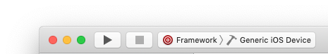

#  Technical guide

## Repository structure

*AmadeusCheckoutCore* contains the core SDK. It doesn't come with any third party dependency, and can be used by any application to perform payment with *Amadeus Payment Platform*.

*SwiftShowcase* and *ObjcShowcase* are demo applications using the core SDK.

*AmadeusCheckout-`name`* are plugins for the core SDK.

## Build dynamic frameworks

- Run `carthage update`
- Open the *AmadeusCheckout.xcworkspace* workspace
- Select the *Framework* target, and *Generic iOS Device* as device

- Then click on the build button
- The folder containing the frameworks will automatically open

## Plugins

[Read plugin documentation](PLUGINS.md)
